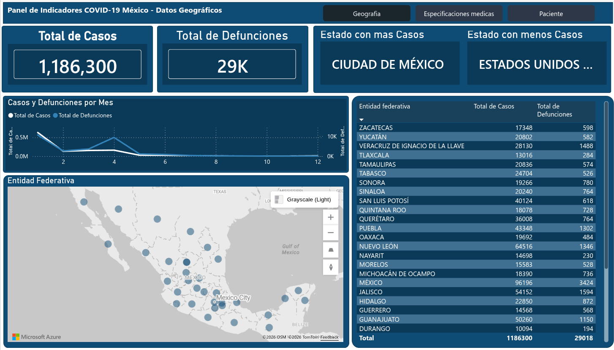
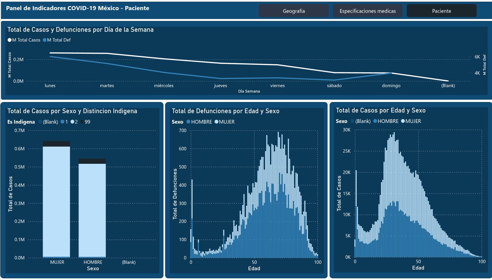
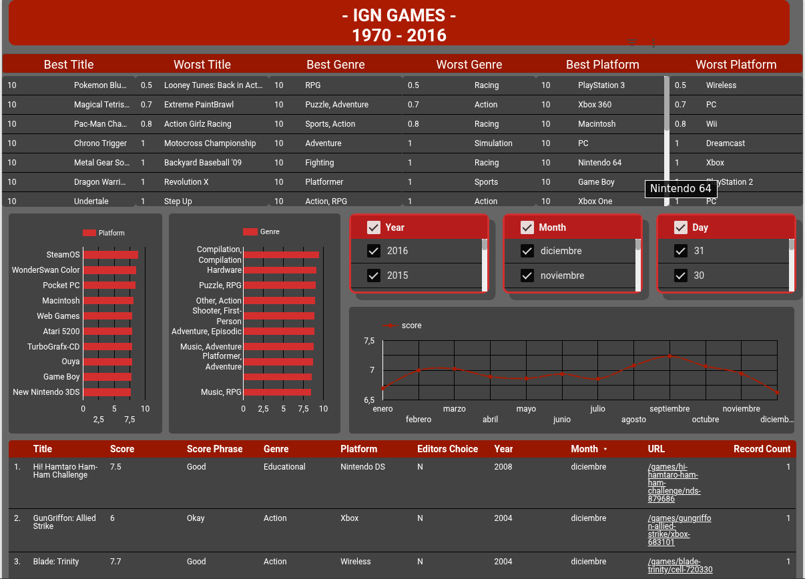

<h1 align="center">👋 Hola, soy Juriel</h1>
<h3 align="center">📊 Analista de Datos → 🚀 Aspirante a Ingeniero & Científico de Datos</h3>

<p align="center">
  
</p>

---

## 🧑‍💻 Sobre mí

Soy analista de datos con experiencia en extracción, transformación y visualización de datos. Me encuentro en un camino de crecimiento profesional hacia la ingeniería y ciencia de datos, construyendo proyectos que van desde pipelines ETL hasta análisis exploratorios y dashboards interactivos.

- 🔭 Actualmente trabajando en proyectos de **análisis y modelado de datos**
- 🌱 Aprendiendo **Cloud (GCP / AWS)**, **Machine Learning** y **Data Engineering**
- 💬 Usando **Python, SQL, Power BI, Looker, Pandas**
- 📍 México

---

## 🛠️ Stack Tecnológico

<p align="center">
  
  
  
  
  
  
  
  
  
  
  
</p>

---

## 📂 Proyectos Destacados

### 🦠 Análisis de Datos — COVID-19 México

> Pipeline ETL completo para el análisis de datos epidemiológicos de COVID-19 en México. Incluye extracción, transformación, carga y visualización de los datos oficiales de la Secretaría de Salud.

**Tecnologías:** `Python` · `Jupyter Notebook` · `Pandas` · `SQL`

**Estructura del proyecto:**
```
📁 01_EXTRACT  →  Recolección de datos
📁 02_TRANSFORM →  Limpieza y transformación
📁 03_LOAD      →  Carga a base de datos
📁 BI           →  Dashboards y visualizaciones
```

<!-- 🖼️ IMAGEN DEL PROYECTO: Reemplaza la URL con un screenshot de tu dashboard o notebook -->



> 📌 **[Ver repositorio →](https://github.com/juriel1/Data-Analysis-Covid19-Mexico)**

---

### 🎮 EDA — IGN Games

> Análisis Exploratorio de Datos (EDA) sobre el desempeño y calificación de videojuegos proporcionados por IGN. El proyecto abarca desde la recolección del dataset en Kaggle hasta dashboards en Power BI y Google Looker.

**Tecnologías:** `Python` · `SQL` · `Jupyter Notebook` · `Power BI` · `Google Looker`

**Funcionalidades:**
- Recolección, procesamiento y limpieza de datos
- Análisis estadístico exploratorio
- Dashboard interactivo en **Google Looker**
- Dashboard interactivo en **Power BI**



> 📌 **[Ver repositorio →](https://github.com/juriel1/EDA-IGN-GAME)**

---

## 📈 GitHub Stats

<p align="center">
  
  
</p>

---

## 🤝 Conecta conmigo

<p align="center">
  <!-- 🔗 Agrega tu LinkedIn real aquí -->
  <a href="https://www.linkedin.com/in/uriel-castillon-488a49228">
    
  </a>
  <!-- 📧 Agrega tu correo o reemplaza con otro medio de contacto -->
  <a href="mailto:j.uriel.castillon@gmail.com">
    
  </a>
  <a href="https://github.com/juriel1">
    
  </a>
</p>

---

<p align="center">
  <i>"Los datos cuentan historias. Mi trabajo es escucharlas y comunicarlas."</i>
</p>
